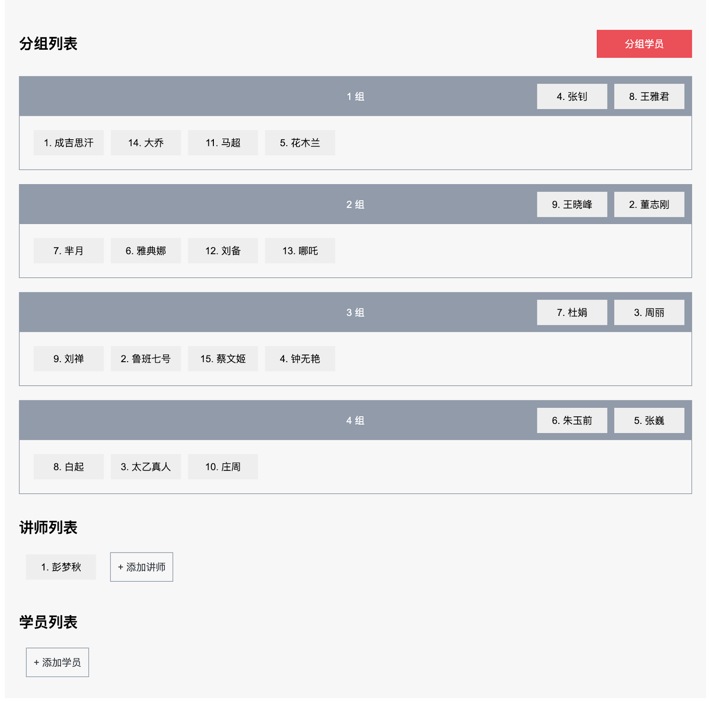

# Final Quiz 后端需求说明

开发一个 Spring Boot Web Application，提供 API 供前端 app 调用。

技术要求如下：

* 请统一使用默认的 8080 端口，无需使用 HTTPS；
* 需编写尽可能完善的自动化测试；
* 使用Docker Compose来初始化程序数据库和测试数据库
  - 版本：MySQL 8.0.22 
  - Mysql端口： 3333 / 测试：3334
  - 用户使用 `root`
  - 密码为 `final_quiz` / 测试： `final_quiz_test`
  - database 名字为 `final_quiz` / 测试： `final_quiz_test`

## 注意
本次 quiz 后端部分的`完成度`维度将由自动化测试自动判定，请**严格按照**作业要求来实现，保证各个细节上准确无误。例如：

* 字段名称、类型
* URL、HTTP method，以及 response status
* 字段校验规则
* 初始化好默认的教师和学员信息
* 项目结构清晰

在最终提交前，请保证：

* 在命令行运行 `./gradlew bootRun` 能够正常启动 application
* 请使用`curl`或`Postman`对 API 进行充分测试，保证功能正确

特别说明：

* 一个英文字母，如`A`，或一个汉字，如`汉`，均视为一个`字符`，暂不考虑其它语言文字或表情符号。

## 系统界面

## 需求列表
- 在学员列表可以查看“未分组”学员的基本信息，包含学员ID、姓名
- 在讲师列表可以查看“未分组”讲师的基本信息，包含讲师ID、姓名
- 当用户点击“分组学员”按钮时，会对学员和讲师进行分组并在页面中显示分组列表
  - 分组列表信息包含：组名、讲师列表、学员列表（见Mockup）
  - 分组规则为：按照讲师数量进行分组，每个组2个讲师（当讲师数量为奇数时，多出来的1位讲师不进行分组），系统对讲师进行随机分组；学员按照之前的规则平均分配到每组。举例：
    - 若有6个讲师，则分为3组
    - 若有7个讲师，则分为3组，第7位讲师不会被分组
    - 若仅有0或1个讲师，则不会进行分组。后台返回400 Status Code，页面提示“分组失败”alert警告提示
  - 当再次点击“分组学员”按钮时，系统对全部学员重新进行分组，重新分组后的组名依然需要符合之前的组名要求，从 “1 组”开始
- 当用户Hover到学员基本信息（ID.姓名）时，右侧显示删除按钮，点击删除按钮，可以删除学员
- 删除讲师（需求同删除学员）
- 当用户点击“添加讲师”按钮时，进入编辑模式，能够在输入框中添加讲师姓名，讲师可以重名；触发“Enter”键创建讲师，系统自动分配讲师ID；添加讲师不会触发自动分组
- 当用户点击“添加学员”按钮时，进入编辑模式，能够在输入框中添加学员姓名，学员可以重名；触发“Enter”键创建学员，系统自动分配学员ID；添加学员不会触发自动分组

> 注意：只需要开发需求对应的后端接口即可，不需要实现前端交互，接口列表已在下方列出
### 初始化数据
#### 默认内置讲师列表
- 彭梦秋
- 董志刚
- 周丽
- 张钊
- 张巍
- 朱玉前
- 杜娟
- 王雅君
- 王晓峰

#### 默认内置学员列表
- 成吉思汗
- 鲁班七号
- 太乙真人
- 钟无艳
- 花木兰
- 雅典娜
- 芈月
- 白起
- 刘禅
- 庄周
- 马超
- 刘备
- 哪吒
- 大乔
- 蔡文姬

## 术语表

| 中文          | 英文               |
| ------------------ | ------------------ |
| 讲师            | trainer               |
| 学员        | trainee             |
| 组           | group            |

## API 列表

本 Quiz 后端 app 共需提供以下 API：

* 查询所有未分组学员
* 添加新学员
* 删除学员
* 查询所有未分组讲师
* 添加新讲师
* 删除讲师
* 查询所有分组
* 自动随机分组讲师和学员

### 查询所有未分组学员

只返回未被分组的学员，已被分配到 group 的学员不会出现在此 API 的返回结果中。

#### ENDPOINT

GET /trainees?grouped=false

#### RESPONSE

##### Status

成功时返回 200 OK。

其它情况请根据 REST API Design 自行选择合理的实现。

##### Body

查询成功会返回 trainee 的 list，如果没有未分组的学员，则返回 `[]`：

| 字段:类型          | 说明               |
| ------------------ | ------------------ |
| id:long            | ID。               |
| name:string        | 名字。             |

#### EXAMPLE

```shell
$ curl 'localhost:8080/trainees?grouped=false'
[
    {
        "id": 1,
        "name": "Foo"
    },
    {
        "id": 2,
        "name": "Bar"
    }
]
```

### 添加新学员

#### ENDPOINT

POST /trainees

#### REQUEST

| 字段:类型      | 校验要求 | 说明               |
| --------------|---- | ------------------ |
| name:string   | 非空 | 名字。             |

#### RESPONSE

##### Status

成功时返回 201 Created。

校验失败时返回 400 Bad Request。

其它情况请根据 REST API Design 自行选择合理的实现。

##### Body

创建成功的 trainee 资源。

| 字段:类型      | 说明               |
| --------------|------------------ |
| id:long       | ID。               |
| name:string   | 名字。             |

#### EXAMPLE

```shell
$ curl -v -H "Content-Type: application/json" --data @trainee.json localhost:8080/trainees
{
    "id": 11,
    "name": "Foo"
}
```

### 删除学员

#### ENDPOINT

DELETE /trainees/{trainee_id}

#### REQUEST

| 字段:类型      | 说明                |
| --------------| ------------------ |
| trainee_id:long | Trainee ID。     |

#### RESPONSE

##### Status

成功时返回 204 No Content。

`{trainee_id}` 不存在时返回 404 Not Found。

其它情况请根据 REST API Design 自行选择合理的实现。

#### EXAMPLE

```shell
$ curl -X DELETE localhost:8080/trainees/11
```

### 查询所有未分组讲师

只返回未被分组的讲师，已被分配到 group 的讲师不会出现在此 API 的返回结果中。

#### ENDPOINT

GET /trainers?grouped=false

#### RESPONSE

##### Status

成功时返回 200 OK。

其它情况请根据 REST API Design 自行选择合理的实现。

##### Body

查询成功会返回 trainer 的 list，如果没有未分组的讲师，则返回 `[]`：

| 字段:类型          | 说明               |
| ------------------ | ------------------ |
| id:long            | ID。               |
| name:string        | 名字。             |

#### EXAMPLE

```shell
$ curl 'localhost:8080/trainers?grouped=false'
[
    {
        "id": 1,
        "name": "Fizz"
    },
    {
        "id": 2,
        "name": "Buzz"
    }
]
```

### 添加新讲师

#### ENDPOINT

POST /trainers

#### REQUEST

| 字段:类型      | 校验要求 | 说明            |
| --------------|---- | ------------------ |
| name:string   | 非空 | 名字。              |

#### RESPONSE

##### Status

成功时返回 201 Created。

校验失败时返回 400 Bad Request。

其它情况请根据 REST API Design 自行选择合理的实现。

##### Body

创建成功的 trainer 资源。

| 字段:类型      | 说明               |
| --------------|------------------- |
| id:long       | ID。               |
| name:string   | 名字。             |

#### EXAMPLE

```shell
$ curl -v -H "Content-Type: application/json" --data @trainer.json localhost:8080/trainers
{
    "id": 1,
    "name": "Fizz"
}
```

### 删除讲师

#### ENDPOINT

DELETE /trainers/{trainer_id}

#### REQUEST

| 字段:类型      | 说明                |
| --------------| ------------------ |
| trainer_id:long | Trainer ID。     |

#### RESPONSE

##### Status

成功时返回 204 No Content。

`{trainer_id}` 不存在时返回 404 Not Found。

其它情况请根据 REST API Design 自行选择合理的实现。

#### EXAMPLE

```shell
$ curl -X DELETE localhost:8080/trainers/1
```

### 查询所有分组

#### ENDPOINT

GET /groups

#### RESPONSE

##### Status

成功时返回 200 Ok。

其它情况请根据 REST API Design 自行选择合理的实现。

##### Body

查询成功会返回 group 的 list，如果没有分组，则返回 `[]`：

| 字段:类型      | 说明               |
| --------------|------------------- |
| id:long       | ID。               |
| name:string   | 分组名字。           |
| trainers:list | 分组内包含的讲师列表。 |
| trainees:list | 分组内包含的学员列表。 |

#### EXAMPLE

```shell
$ curl localhost:8080/groups
[
    {
        "id": 1,
        "name": "1 组",
        "trainers": [
            {
                "id": 5,
                "name": "张巍"
            },
            {
                "id": 1,
                "name": "张钊"
            }
        ],
        "trainees": [
            {
                "id": 1,
                "name": "Foo"
            }
        ]
    },
    {
        "id": 2,
        "name": "2 组",
        "trainers": [
            {
                "id": 2,
                "name": "朱玉前"
            },
            {
                "id": 3,
                "name": "贵溪京"
            }
        ],
        "trainees": [
            {
                "id": 2,
                "name": "Bar"
            }
        ]
    }
]
```

### 自动随机分组讲师和学员

#### ENDPOINT

POST /groups/auto-grouping

#### RESPONSE

##### Status

成功时返回 200 Ok。

不满足分组条件（比如：讲师人数小于 2 人）时返回 400 Bad Request。

其它情况请根据 REST API Design 自行选择合理的实现。

##### Body

分组成功会返回 group 的 list：

| 字段:类型      | 说明               |
| --------------|------------------- |
| id:long       | ID。               |
| name:string   | 分组名字。           |
| trainers:list | 分组内包含的讲师列表。 |
| trainees:list | 分组内包含的学员列表。 |

#### EXAMPLE

```shell
$ curl -X POST localhost:8080/groups/auto-grouping
[
    {
        "id": 1,
        "name": "1 组",
        "trainers": [
            {
                "id": 5,
                "name": "张巍"
            },
            {
                "id": 1,
                "name": "张钊"
            }
        ],
        "trainees": [
            {
                "id": 1,
                "name": "Foo"
            }
        ]
    },
    {
        "id": 2,
        "name": "2 组",
        "trainers": [
            {
                "id": 2,
                "name": "朱玉前"
            },
            {
                "id": 3,
                "name": "贵溪京"
            }
        ],
        "trainees": [
            {
                "id": 2,
                "name": "Bar"
            }
        ]
    }
]
```

## 返回结果说明

使用标准 HTTP Status Code 来标识返回结果成功或失败与否。

本 quiz 允许使用的 status code 范围如下表：

| HTTP Status Code    | Summary                                                  |
| ------------------- | -------------------------------------------------------- |
| 200 - OK            | 查询操作一切正常，返回 200 及查询结果。                  |
| 201 - Created       | 创建操作成功，返回 201。                                 |
| 204 - No Content    | 用于 DELETE 或 某些 POST 等操作无返回数据时。                        |
| 400 - Bad Request   | 请求参数不符合要求，通常是因为参数格式不正确或参数缺失。 |
| 404 - Not Found     | 请求的资源不存在。                                       |
| 500 - Server Errors | 请求在处理时遇到服务器错误。                                   |

除了返回对应的 status code 外，对于出错的情况，还需返回 Error 对象，字段如下：

| 字段:类型        | 说明                                                         |
| ---------------- | ------------------------------------------------------------ |
| message:string   | 错误提示信息，内容可以自行编写，表意即可。如：Cannot find basic info of person with id is 666. |

一个示例如下：

```shell
curl -v --data '{"name": "Foo"}' -H "Content-Type: application/json" localhost:8080/trainees                                                                                                                                                                              ░▒▓ 100%  ▓▒░
*   Trying ::1...
* TCP_NODELAY set
* Connected to localhost (::1) port 8080 (#0)
> POST /trainees HTTP/1.1
> Host: localhost:8080
> User-Agent: curl/7.64.1
> Accept: */*
> Content-Type: application/json
> Content-Length: 15
>
* upload completely sent off: 15 out of 15 bytes
< HTTP/1.1 400
< Vary: Origin
< Vary: Access-Control-Request-Method
< Vary: Access-Control-Request-Headers
< Content-Type: application/json
< Transfer-Encoding: chunked
< Date: Thu, 24 Sep 2020 00:14:02 GMT
< Connection: close
<
* Closing connection 0
{"message":"Invalid values."}
```
